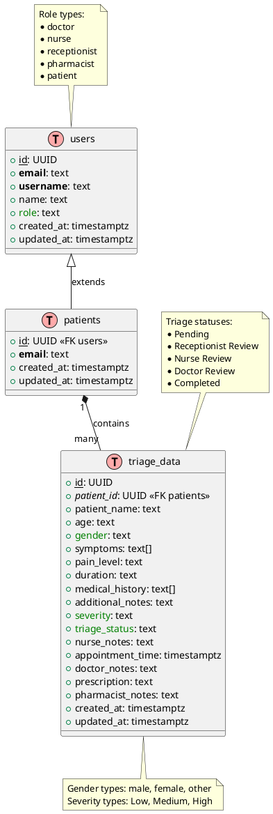

# Triage Database Design

```plantuml
@startuml Database Schema

!define table(x) class x << (T,#FFAAAA) >>
!define primary_key(x) <u>x</u>
!define foreign_key(x) <i>x</i>
!define unique(x) <b>x</b>
!define enum(x) <color:green>x</color>

note as N1
  Role types:
  * doctor
  * nurse
  * receptionist
  * pharmacist
  * patient
end note

note as N2
  Triage statuses:
  * Pending
  * Receptionist Review
  * Nurse Review
  * Doctor Review
  * Completed
end note

table(users) {
  + primary_key(id): UUID
  + unique(email): text
  + unique(username): text
  + name: text
  + enum(role): text
  + created_at: timestamptz
  + updated_at: timestamptz
}

table(patients) {
  + primary_key(id): UUID <<FK users>>
  + unique(email): text
  + created_at: timestamptz
  + updated_at: timestamptz
}

table(triage_data) {
  + primary_key(id): UUID
  + foreign_key(patient_id): UUID <<FK patients>>
  + patient_name: text
  + age: text
  + enum(gender): text
  + symptoms: text[]
  + pain_level: text
  + duration: text
  + medical_history: text[]
  + additional_notes: text
  + enum(severity): text
  + enum(triage_status): text
  + nurse_notes: text
  + appointment_time: timestamptz
  + doctor_notes: text
  + prescription: text
  + pharmacist_notes: text
  + created_at: timestamptz
  + updated_at: timestamptz
}

users <|-- patients : extends
patients "1" *-- "many" triage_data : contains

N1 .. users
N2 .. triage_data

note bottom of triage_data
  Gender types: male, female, other
  Severity types: Low, Medium, High
end note

@enduml
```

# PlantUML

