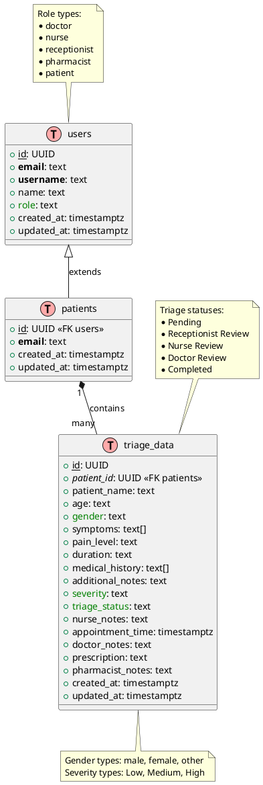

# Triage Database Design

<svg xmlns="http://www.w3.org/2000/svg" xmlns:xlink="http://www.w3.org/1999/xlink" contentStyleType="text/css" height="1062px" preserveAspectRatio="none" style="width:416px;height:1062px;background:#FFFFFF;" version="1.1" viewBox="0 0 416 1062" width="416px" zoomAndPan="magnify"><defs/><g><g id="elem_N1"><path d="M53.34,6 L53.34,106.7969 A0,0 0 0 0 53.34,106.7969 L104.4,106.7969 L108.4,167.57 L112.4,106.7969 L163.464,106.7969 A0,0 0 0 0 163.464,106.7969 L163.464,16 L153.464,6 L53.34,6 A0,0 0 0 0 53.34,6 " fill="#FEFFDD" style="stroke:#181818;stroke-width:0.5;"/><path d="M153.464,6 L153.464,16 L163.464,16 L153.464,6 " fill="#FEFFDD" style="stroke:#181818;stroke-width:0.5;"/><text fill="#000000" font-family="sans-serif" font-size="13" lengthAdjust="spacing" textLength="72.9219" x="59.34" y="23.0669">Role types:</text><ellipse cx="64.84" cy="33.7656" fill="#000000" rx="2.5" ry="2.5" style="stroke:#000000;stroke-width:0;"/><text fill="#000000" font-family="sans-serif" font-size="13" lengthAdjust="spacing" textLength="41.7485" x="71.34" y="38.1997">doctor</text><ellipse cx="64.84" cy="48.8984" fill="#000000" rx="2.5" ry="2.5" style="stroke:#000000;stroke-width:0;"/><text fill="#000000" font-family="sans-serif" font-size="13" lengthAdjust="spacing" textLength="36.5942" x="71.34" y="53.3325">nurse</text><ellipse cx="64.84" cy="64.0313" fill="#000000" rx="2.5" ry="2.5" style="stroke:#000000;stroke-width:0;"/><text fill="#000000" font-family="sans-serif" font-size="13" lengthAdjust="spacing" textLength="77.124" x="71.34" y="68.4653">receptionist</text><ellipse cx="64.84" cy="79.1641" fill="#000000" rx="2.5" ry="2.5" style="stroke:#000000;stroke-width:0;"/><text fill="#000000" font-family="sans-serif" font-size="13" lengthAdjust="spacing" textLength="73.0615" x="71.34" y="83.5981">pharmacist</text><ellipse cx="64.84" cy="94.2969" fill="#000000" rx="2.5" ry="2.5" style="stroke:#000000;stroke-width:0;"/><text fill="#000000" font-family="sans-serif" font-size="13" lengthAdjust="spacing" textLength="46.2617" x="71.34" y="98.731">patient</text></g><g id="elem_N2"><path d="M244.95,413.07 L244.95,513.8669 A0,0 0 0 0 244.95,513.8669 L305.89,513.8669 L280.95,596.76 L313.89,513.8669 L409.8606,513.8669 A0,0 0 0 0 409.8606,513.8669 L409.8606,423.07 L399.8606,413.07 L244.95,413.07 A0,0 0 0 0 244.95,413.07 " fill="#FEFFDD" style="stroke:#181818;stroke-width:0.5;"/><path d="M399.8606,413.07 L399.8606,423.07 L409.8606,423.07 L399.8606,413.07 " fill="#FEFFDD" style="stroke:#181818;stroke-width:0.5;"/><text fill="#000000" font-family="sans-serif" font-size="13" lengthAdjust="spacing" textLength="104.3428" x="250.95" y="430.1369">Triage statuses:</text><ellipse cx="256.45" cy="440.8356" fill="#000000" rx="2.5" ry="2.5" style="stroke:#000000;stroke-width:0;"/><text fill="#000000" font-family="sans-serif" font-size="13" lengthAdjust="spacing" textLength="52.4316" x="262.95" y="445.2697">Pending</text><ellipse cx="256.45" cy="455.9684" fill="#000000" rx="2.5" ry="2.5" style="stroke:#000000;stroke-width:0;"/><text fill="#000000" font-family="sans-serif" font-size="13" lengthAdjust="spacing" textLength="131.9106" x="262.95" y="460.4025">Receptionist Review</text><ellipse cx="256.45" cy="471.1013" fill="#000000" rx="2.5" ry="2.5" style="stroke:#000000;stroke-width:0;"/><text fill="#000000" font-family="sans-serif" font-size="13" lengthAdjust="spacing" textLength="89.1782" x="262.95" y="475.5353">Nurse Review</text><ellipse cx="256.45" cy="486.2341" fill="#000000" rx="2.5" ry="2.5" style="stroke:#000000;stroke-width:0;"/><text fill="#000000" font-family="sans-serif" font-size="13" lengthAdjust="spacing" textLength="94.6055" x="262.95" y="490.6681">Doctor Review</text><ellipse cx="256.45" cy="501.3669" fill="#000000" rx="2.5" ry="2.5" style="stroke:#000000;stroke-width:0;"/><text fill="#000000" font-family="sans-serif" font-size="13" lengthAdjust="spacing" textLength="70.9033" x="262.95" y="505.801">Completed</text></g><!--class users--><g id="elem_users"><rect codeLine="25" fill="#F1F1F1" height="162.0781" id="users" rx="2.5" ry="2.5" style="stroke:#181818;stroke-width:0.5;" width="202.8047" x="7" y="167.8"/><ellipse cx="85.2373" cy="183.8" fill="#FFAAAA" rx="11" ry="11" style="stroke:#181818;stroke-width:1;"/><path d="M86.0811,190.55 L83.6279,190.55 L83.6279,180.3 L80.4873,180.3 L80.4873,178.1594 L89.2217,178.1594 L89.2217,180.3 L86.0811,180.3 L86.0811,190.55 Z " fill="#000000"/><text fill="#000000" font-family="sans-serif" font-size="14" lengthAdjust="spacing" textLength="37.8301" x="105.7373" y="188.6467">users</text><line style="stroke:#181818;stroke-width:0.5;" x1="8" x2="208.8047" y1="199.8" y2="199.8"/><ellipse cx="18" cy="213.4484" fill="none" rx="3" ry="3" style="stroke:#038048;stroke-width:1;"/><text fill="#000000" font-family="sans-serif" font-size="14" lengthAdjust="spacing" text-decoration="underline" textLength="12.7764" x="27" y="216.7951">id</text><text fill="#000000" font-family="sans-serif" font-size="14" lengthAdjust="spacing" textLength="44.5703" x="39.7764" y="216.7951">: UUID</text><ellipse cx="18" cy="229.7453" fill="none" rx="3" ry="3" style="stroke:#038048;stroke-width:1;"/><text fill="#000000" font-family="sans-serif" font-size="14" font-weight="bold" lengthAdjust="spacing" textLength="43.1279" x="27" y="233.092">email</text><text fill="#000000" font-family="sans-serif" font-size="14" lengthAdjust="spacing" textLength="37.0439" x="70.1279" y="233.092">: text</text><ellipse cx="18" cy="246.0422" fill="none" rx="3" ry="3" style="stroke:#038048;stroke-width:1;"/><text fill="#000000" font-family="sans-serif" font-size="14" font-weight="bold" lengthAdjust="spacing" textLength="78.1963" x="27" y="249.3889">username</text><text fill="#000000" font-family="sans-serif" font-size="14" lengthAdjust="spacing" textLength="37.0439" x="105.1963" y="249.3889">: text</text><ellipse cx="18" cy="262.3391" fill="none" rx="3" ry="3" style="stroke:#038048;stroke-width:1;"/><text fill="#000000" font-family="sans-serif" font-size="14" lengthAdjust="spacing" textLength="76.7471" x="27" y="265.6857">name: text</text><ellipse cx="18" cy="278.6359" fill="none" rx="3" ry="3" style="stroke:#038048;stroke-width:1;"/><text fill="#008000" font-family="sans-serif" font-size="14" lengthAdjust="spacing" textLength="26.8242" x="27" y="281.9826">role</text><text fill="#000000" font-family="sans-serif" font-size="14" lengthAdjust="spacing" textLength="37.0439" x="53.8242" y="281.9826">: text</text><ellipse cx="18" cy="294.9328" fill="none" rx="3" ry="3" style="stroke:#038048;stroke-width:1;"/><text fill="#000000" font-family="sans-serif" font-size="14" lengthAdjust="spacing" textLength="172.2246" x="27" y="298.2795">created_at: timestamptz</text><ellipse cx="18" cy="311.2297" fill="none" rx="3" ry="3" style="stroke:#038048;stroke-width:1;"/><text fill="#000000" font-family="sans-serif" font-size="14" lengthAdjust="spacing" textLength="176.8047" x="27" y="314.5764">updated_at: timestamptz</text><line style="stroke:#181818;stroke-width:0.5;" x1="8" x2="208.8047" y1="321.8781" y2="321.8781"/></g><!--class patients--><g id="elem_patients"><rect codeLine="35" fill="#F1F1F1" height="113.1875" id="patients" rx="2.5" ry="2.5" style="stroke:#181818;stroke-width:0.5;" width="202.8047" x="7" y="406.88"/><ellipse cx="75.5952" cy="422.88" fill="#FFAAAA" rx="11" ry="11" style="stroke:#181818;stroke-width:1;"/><path d="M76.439,429.63 L73.9858,429.63 L73.9858,419.38 L70.8452,419.38 L70.8452,417.2394 L79.5796,417.2394 L79.5796,419.38 L76.439,419.38 L76.439,429.63 Z " fill="#000000"/><text fill="#000000" font-family="sans-serif" font-size="14" lengthAdjust="spacing" textLength="57.1143" x="96.0952" y="427.7267">patients</text><line style="stroke:#181818;stroke-width:0.5;" x1="8" x2="208.8047" y1="438.88" y2="438.88"/><ellipse cx="18" cy="452.5284" fill="none" rx="3" ry="3" style="stroke:#038048;stroke-width:1;"/><text fill="#000000" font-family="sans-serif" font-size="14" lengthAdjust="spacing" text-decoration="underline" textLength="12.7764" x="27" y="455.8751">id</text><text fill="#000000" font-family="sans-serif" font-size="14" lengthAdjust="spacing" textLength="125.665" x="39.7764" y="455.8751">: UUID &#171;FK users&#187;</text><ellipse cx="18" cy="468.8253" fill="none" rx="3" ry="3" style="stroke:#038048;stroke-width:1;"/><text fill="#000000" font-family="sans-serif" font-size="14" font-weight="bold" lengthAdjust="spacing" textLength="43.1279" x="27" y="472.172">email</text><text fill="#000000" font-family="sans-serif" font-size="14" lengthAdjust="spacing" textLength="37.0439" x="70.1279" y="472.172">: text</text><ellipse cx="18" cy="485.1222" fill="none" rx="3" ry="3" style="stroke:#038048;stroke-width:1;"/><text fill="#000000" font-family="sans-serif" font-size="14" lengthAdjust="spacing" textLength="172.2246" x="27" y="488.4689">created_at: timestamptz</text><ellipse cx="18" cy="501.4191" fill="none" rx="3" ry="3" style="stroke:#038048;stroke-width:1;"/><text fill="#000000" font-family="sans-serif" font-size="14" lengthAdjust="spacing" textLength="176.8047" x="27" y="504.7657">updated_at: timestamptz</text><line style="stroke:#181818;stroke-width:0.5;" x1="8" x2="208.8047" y1="512.0675" y2="512.0675"/></g><!--class triage_data--><g id="elem_triage_data"><rect codeLine="42" fill="#F1F1F1" height="357.6406" id="triage_data" rx="2.5" ry="2.5" style="stroke:#181818;stroke-width:0.5;" width="251.9346" x="92.44" y="597.06"/><ellipse cx="174.2833" cy="613.06" fill="#FFAAAA" rx="11" ry="11" style="stroke:#181818;stroke-width:1;"/><path d="M175.127,619.81 L172.6739,619.81 L172.6739,609.56 L169.5333,609.56 L169.5333,607.4194 L178.2676,607.4194 L178.2676,609.56 L175.127,609.56 L175.127,619.81 Z " fill="#000000"/><text fill="#000000" font-family="sans-serif" font-size="14" lengthAdjust="spacing" textLength="79.748" x="194.7833" y="617.9067">triage_data</text><line style="stroke:#181818;stroke-width:0.5;" x1="93.44" x2="343.3746" y1="629.06" y2="629.06"/><ellipse cx="103.44" cy="642.7084" fill="none" rx="3" ry="3" style="stroke:#038048;stroke-width:1;"/><text fill="#000000" font-family="sans-serif" font-size="14" lengthAdjust="spacing" text-decoration="underline" textLength="12.7764" x="112.44" y="646.0551">id</text><text fill="#000000" font-family="sans-serif" font-size="14" lengthAdjust="spacing" textLength="44.5703" x="125.2164" y="646.0551">: UUID</text><ellipse cx="103.44" cy="659.0053" fill="none" rx="3" ry="3" style="stroke:#038048;stroke-width:1;"/><text fill="#000000" font-family="sans-serif" font-size="14" font-style="italic" lengthAdjust="spacing" textLength="69.5967" x="112.44" y="662.352">patient_id</text><text fill="#000000" font-family="sans-serif" font-size="14" lengthAdjust="spacing" textLength="144.9492" x="182.0367" y="662.352">: UUID &#171;FK patients&#187;</text><ellipse cx="103.44" cy="675.3022" fill="none" rx="3" ry="3" style="stroke:#038048;stroke-width:1;"/><text fill="#000000" font-family="sans-serif" font-size="14" lengthAdjust="spacing" textLength="133.5674" x="112.44" y="678.6489">patient_name: text</text><ellipse cx="103.44" cy="691.5991" fill="none" rx="3" ry="3" style="stroke:#038048;stroke-width:1;"/><text fill="#000000" font-family="sans-serif" font-size="14" lengthAdjust="spacing" textLength="63.123" x="112.44" y="694.9457">age: text</text><ellipse cx="103.44" cy="707.8959" fill="none" rx="3" ry="3" style="stroke:#038048;stroke-width:1;"/><text fill="#008000" font-family="sans-serif" font-size="14" lengthAdjust="spacing" textLength="49.6289" x="112.44" y="711.2426">gender</text><text fill="#000000" font-family="sans-serif" font-size="14" lengthAdjust="spacing" textLength="37.0439" x="162.0689" y="711.2426">: text</text><ellipse cx="103.44" cy="724.1928" fill="none" rx="3" ry="3" style="stroke:#038048;stroke-width:1;"/><text fill="#000000" font-family="sans-serif" font-size="14" lengthAdjust="spacing" textLength="121.0576" x="112.44" y="727.5395">symptoms: text[]</text><ellipse cx="103.44" cy="740.4897" fill="none" rx="3" ry="3" style="stroke:#038048;stroke-width:1;"/><text fill="#000000" font-family="sans-serif" font-size="14" lengthAdjust="spacing" textLength="107.5635" x="112.44" y="743.8364">pain_level: text</text><ellipse cx="103.44" cy="756.7866" fill="none" rx="3" ry="3" style="stroke:#038048;stroke-width:1;"/><text fill="#000000" font-family="sans-serif" font-size="14" lengthAdjust="spacing" textLength="95.9561" x="112.44" y="760.1332">duration: text</text><ellipse cx="103.44" cy="773.0834" fill="none" rx="3" ry="3" style="stroke:#038048;stroke-width:1;"/><text fill="#000000" font-family="sans-serif" font-size="14" lengthAdjust="spacing" textLength="158.3135" x="112.44" y="776.4301">medical_history: text[]</text><ellipse cx="103.44" cy="789.3803" fill="none" rx="3" ry="3" style="stroke:#038048;stroke-width:1;"/><text fill="#000000" font-family="sans-serif" font-size="14" lengthAdjust="spacing" textLength="152.4072" x="112.44" y="792.727">additional_notes: text</text><ellipse cx="103.44" cy="805.6772" fill="none" rx="3" ry="3" style="stroke:#038048;stroke-width:1;"/><text fill="#008000" font-family="sans-serif" font-size="14" lengthAdjust="spacing" textLength="56.2256" x="112.44" y="809.0239">severity</text><text fill="#000000" font-family="sans-serif" font-size="14" lengthAdjust="spacing" textLength="37.0439" x="168.6656" y="809.0239">: text</text><ellipse cx="103.44" cy="821.9741" fill="none" rx="3" ry="3" style="stroke:#038048;stroke-width:1;"/><text fill="#008000" font-family="sans-serif" font-size="14" lengthAdjust="spacing" textLength="91.2324" x="112.44" y="825.3207">triage_status</text><text fill="#000000" font-family="sans-serif" font-size="14" lengthAdjust="spacing" textLength="37.0439" x="203.6724" y="825.3207">: text</text><ellipse cx="103.44" cy="838.2709" fill="none" rx="3" ry="3" style="stroke:#038048;stroke-width:1;"/><text fill="#000000" font-family="sans-serif" font-size="14" lengthAdjust="spacing" textLength="122.2881" x="112.44" y="841.6176">nurse_notes: text</text><ellipse cx="103.44" cy="854.5678" fill="none" rx="3" ry="3" style="stroke:#038048;stroke-width:1;"/><text fill="#000000" font-family="sans-serif" font-size="14" lengthAdjust="spacing" textLength="225.9346" x="112.44" y="857.9145">appointment_time: timestamptz</text><ellipse cx="103.44" cy="870.8647" fill="none" rx="3" ry="3" style="stroke:#038048;stroke-width:1;"/><text fill="#000000" font-family="sans-serif" font-size="14" lengthAdjust="spacing" textLength="127.8389" x="112.44" y="874.2114">doctor_notes: text</text><ellipse cx="103.44" cy="887.1616" fill="none" rx="3" ry="3" style="stroke:#038048;stroke-width:1;"/><text fill="#000000" font-family="sans-serif" font-size="14" lengthAdjust="spacing" textLength="120.6406" x="112.44" y="890.5082">prescription: text</text><ellipse cx="103.44" cy="903.4584" fill="none" rx="3" ry="3" style="stroke:#038048;stroke-width:1;"/><text fill="#000000" font-family="sans-serif" font-size="14" lengthAdjust="spacing" textLength="161.5605" x="112.44" y="906.8051">pharmacist_notes: text</text><ellipse cx="103.44" cy="919.7553" fill="none" rx="3" ry="3" style="stroke:#038048;stroke-width:1;"/><text fill="#000000" font-family="sans-serif" font-size="14" lengthAdjust="spacing" textLength="172.2246" x="112.44" y="923.102">created_at: timestamptz</text><ellipse cx="103.44" cy="936.0522" fill="none" rx="3" ry="3" style="stroke:#038048;stroke-width:1;"/><text fill="#000000" font-family="sans-serif" font-size="14" lengthAdjust="spacing" textLength="176.8047" x="112.44" y="939.3989">updated_at: timestamptz</text><line style="stroke:#181818;stroke-width:0.5;" x1="93.44" x2="343.3746" y1="946.7006" y2="946.7006"/></g><g id="elem_GMN11"><path d="M94.72,1015.7 L94.72,1055.9656 A0,0 0 0 0 94.72,1055.9656 L342.0838,1055.9656 A0,0 0 0 0 342.0838,1055.9656 L342.0838,1025.7 L332.0838,1015.7 L222.4,1015.7 L218.4,954.99 L214.4,1015.7 L94.72,1015.7 A0,0 0 0 0 94.72,1015.7 " fill="#FEFFDD" style="stroke:#181818;stroke-width:0.5;"/><path d="M332.0838,1015.7 L332.0838,1025.7 L342.0838,1025.7 L332.0838,1015.7 " fill="#FEFFDD" style="stroke:#181818;stroke-width:0.5;"/><text fill="#000000" font-family="sans-serif" font-size="13" lengthAdjust="spacing" textLength="224.5801" x="100.72" y="1032.7669">Gender types: male, female, other</text><text fill="#000000" font-family="sans-serif" font-size="13" lengthAdjust="spacing" textLength="226.3638" x="100.72" y="1047.8997">Severity types: Low, Medium, High</text></g><!--reverse link users to patients--><g id="link_users_patients"><path codeLine="64" d="M108.4,348.22 C108.4,373.63 108.4,383.13 108.4,406.45 " fill="none" id="users-backto-patients" style="stroke:#181818;stroke-width:1;"/><polygon fill="none" points="108.4,330.22,102.4,348.22,114.4,348.22,108.4,330.22" style="stroke:#181818;stroke-width:1;"/><text fill="#000000" font-family="sans-serif" font-size="13" lengthAdjust="spacing" textLength="52.0508" x="109.4" y="372.9469">extends</text></g><!--reverse link patients to triage_data--><g id="link_patients_triage_data"><path codeLine="65" d="M132.2046,531.6321 C140.0246,553.7221 145.48,569.11 155.3,596.82 " fill="none" id="patients-backto-triage_data" style="stroke:#181818;stroke-width:1;"/><polygon fill="#181818" points="128.2,520.32,126.4316,527.3109,132.2046,531.6321,133.973,524.6412,128.2,520.32" style="stroke:#181818;stroke-width:1;"/><text fill="#000000" font-family="sans-serif" font-size="13" lengthAdjust="spacing" textLength="55.0278" x="145.4" y="563.1269">contains</text><text fill="#000000" font-family="sans-serif" font-size="13" lengthAdjust="spacing" textLength="8.271" x="122.1419" y="540.2372">1</text><text fill="#000000" font-family="sans-serif" font-size="13" lengthAdjust="spacing" textLength="36.5625" x="115.8902" y="586.0192">many</text></g><!--SRC=[fLHTRzCm57tFhxWhB-leXhh7Agg4c0e8gD3OdX2AtEGslIAsW-ri3H__dMidRTqK3GdwKjzxZk_dYSyAN9D2S69LuVbs37abh8Kjf2cStqsUBHOl-JU6-Jmvwwcr8IbCctt5rbz8c_asVT4SyBKsIANQu-HnEk2DeczDo9MkFBGwGAWQ6O1SLzhCIeEeF2MOyoHHsY482yjf0d2hAwwxhT7EsBg0GkTEct1KZR4OJWPph1rfHTO5HxqHHefyRmf7g5o2gW0VFSfnpOGxGw94i4wunkuIVMGogJASRwFuR3mGFWR_qbSGEsv2TR7dbPPrXGwBA7ct1avbx1X-CEtvqRYf6C_W_lxjJK3wGQ8KLB7VuTR5VXz52OanvEt83FCsFCUOaniKN5Kc73j98ZSlQ_Uz2rqNVyH-xKhlv_bqzIoknJi8NRAkdchblsfnONaPiyJVXnchjcyY6nIywwslUSSQp9HJ3YTSyeBHn7tPbalLqdQkpr_wWAIo2X-mYfX5OuJNL-IIM50kgcp3cjEcFOeXYe8ydM6lA3iinN9uGwuT3u5-M9tIZoJZbNmIJDIr9kMa7u0V_kbwki_nv69jqEQ6wa5FXy_ovCO_QY382zAVbvVxnS4CE2WlmoPxrsWwWWlcZAHGxGWYpJ0xryhnKcoIBATmTTL9DbbU-tF4x1-DbNQyKz3h8mpWTLX__rI151LEO8tTltORz6_MftulEzPx_JY13xpeHaxW3PMR_IFn6m00]--></g></svg>
